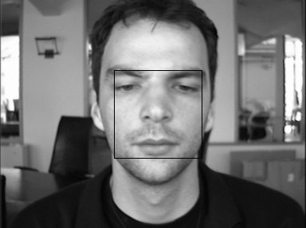

Face Detection
---
based on haar features and adaboost

(Undergraduate coursework - 2016)

---

### Usage

*default*

```
python faceDetection.py someImage.pgm --show=True --save=False -- saveInfo=False
```

---
### Examples


___
### File Description:

* faceDetection.py  : main
* haar.py           : calculate haar feature values
* adaboost.py       : implementation of adaboost
* image.py          : load image and calculate its integral matrix
* setting.py        : all configurations
* detector.py       :
* weakClassifier.py :
* feature.py        :
* model.py          :

---

